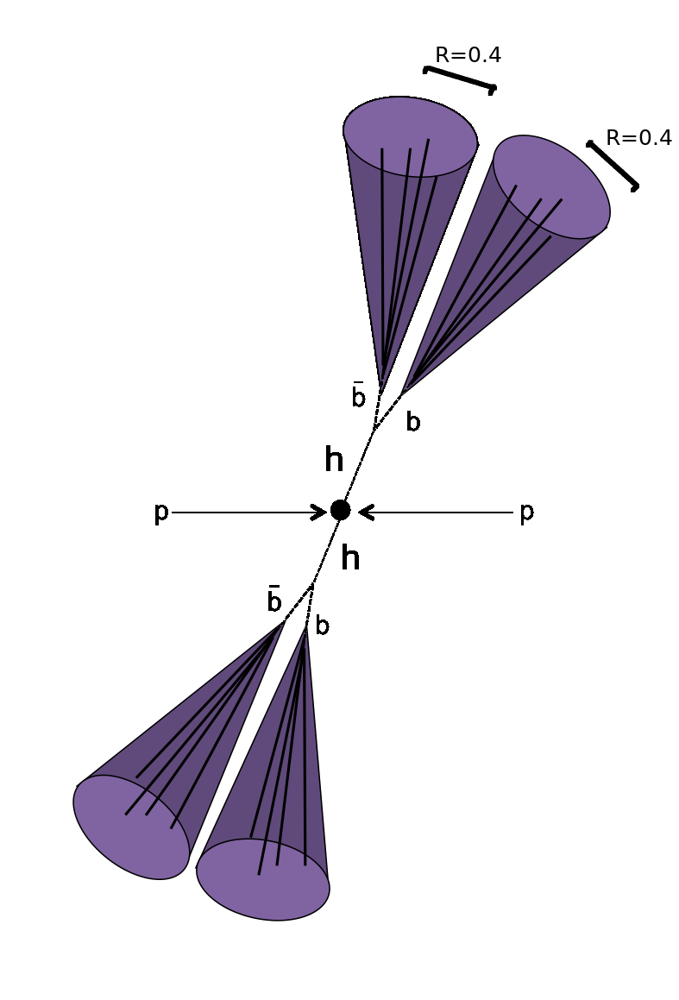

# diHiggs-flow Toolkit

> **Note**: This project is archived and represents completed research from a master's thesis.

Neural density estimation of di-Higgs production at the LHC (e.g., hh → 4b). The toolkit can be used for investigating a variety of di-Higgs decay modes. Full details are available in the [thesis document](Thesis.pdf).

<p align="center">
  
  <br>
  <em>Resolved di-Higgs production analysis targeting the hh → 4b decay channel</em>
</p>

## Background

At the LHC, measuring the cross section of Higgs boson pair-production (di-Higgs production) can allow us to directly probe theories Beyond the Standard Model of physics. Our current understanding of the universe, the Standard Model, is an elegant yet incomplete theory, failing to account for phenomena such as:

- Gravity
- Dark Matter  
- The origin of neutrino mass and oscillations
- Matter-antimatter asymmetry

The Standard Model predicts the cross section of di-Higgs production to be small, while various Beyond the Standard Model theories (e.g., Two-Higgs-doublet models, Randall-Sundrum models, composite Higgs models) predict enhanced rates of di-Higgs production. By measuring the cross section, we can compare the experimentally observed value to the corresponding predictions of Standard Model and Beyond the Standard Model theories. Any deviation from the small production rate predicted by the Standard Model could be an indication of new physics yet to be discovered.

This toolkit models the conditional probability density of resolved di-Higgs events. The example used is hh → 4b events, given that it is the most dominant di-Higgs decay mode. In this scheme, the search for di-Higgs production is done by modeling the production of b-quark jets at the LHC. Such a task allows us to estimate background, enabling us to formulate a statistically unbiased analysis of di-Higgs production.

## Research Context

This work focuses on searching for Beyond the Standard Model physics through di-Higgs production at the Large Hadron Collider. The approach uses modern probabilstic deep learning techniques, specifically normalizing flows, to model the probability distributions of particle collision events.

## Repository Structure

```
diHiggs-flow/
├── src/                    
│   ├── dataloader.py       # Data loading utilities
│   ├── flow.py             # Neural flow implementation
│   └── gaussian_process.py # Gaussian process components
├── notebooks/              
│   └── example_results.ipynb 
├── assets/                 
│   └── Resolved.png        
├── Thesis.pdf              # Complete thesis document
├── LICENSE              
└── README.md 
```

